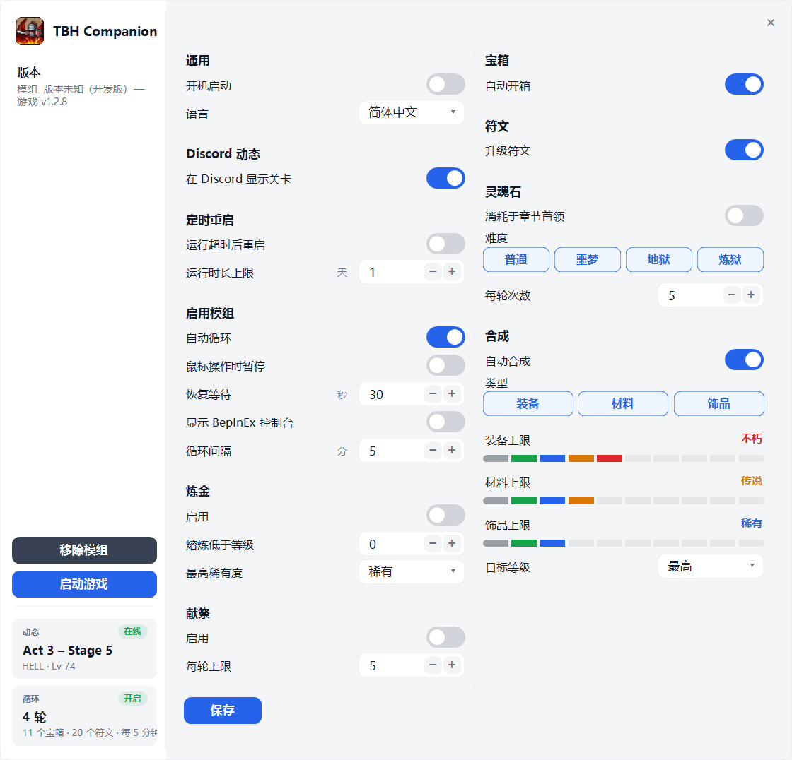

# TBH Companion

[English](README.md) · **简体中文**

**TaskBarHero** 的托盘伴侣程序：在 Discord 上展示你的游戏进度，并自动完成游戏里的挂机杂务。

## 功能

- **Discord 动态** —— 你的个人资料会显示当前关卡、难度和队伍。它只读取游戏内存，从不写入。
- **自动循环**（需要模组）—— 每隔几分钟运行一次：
  **灵魂石 → 宝箱 → 献祭 → 炼金 → 合成 → 符文**。
  - **鼠标操作时暂停** —— 可选。当你在游戏中移动或点击时暂停循环，停止操作一段时间（默认 30 秒）后开始新一轮。
  - **灵魂石** —— 重新进入已通关的章节首领或污染章节首领关卡，使用你允许的最高难度层级（普通/噩梦/地狱/炼狱），然后把英雄带回原关卡。
  - **宝箱** —— 开启 StageBox 宝箱（普通 / 首领 / 章节首领，含瘟疫之地）。
  - **献祭** —— 通过 Cube 消耗献祭币。
  - **炼金** —— 把你设定的等级和稀有度以下的废品装备熔炼成金币。锁定、保留和已装备的物品绝不会被动到。
  - **合成** —— 对装备 / 材料 / 饰品进行 Cube 合成，受稀有度上限和目标配方等级限制。
  - **符文** —— 自动升级符文。
- **定时重启** —— 可选在运行 N 天后关闭并重新启动 TaskBarHero，以释放长时间挂机累积的内存。两个版本都支持。
- **语言** —— 英文或简体中文，在「状态与设置」中选择后立即生效。关卡那一行保持英文，因为它是显示在 Discord 上的。
- **自动更新** —— 游戏更新导致模组落后时会提示你，若存在匹配的发布版本则自动更新自身。

## 该下载哪个？

[发布页面](../../releases) 提供两个版本：

| 下载 | 作用 |
|----------|--------------|
| **`TbhCompanion-Presence.exe`** | Discord 动态与定时重启。不含模组，不向游戏加载任何东西。最安全的选择。 |
| **`TbhCompanion.exe`** | 在上述功能**之外**，额外包含游戏内自动化模组。 |

需要 Windows 10/11 和 [Discord 桌面版](https://discord.com/download)
（网页版不支持动态），并在 Discord 中开启 **设置 → 活动隐私 → 「将当前活动显示为状态消息」**。无需安装任何东西 —— 单个 exe 即可运行。

## 快速上手

1. 下载任一版本并双击运行。系统托盘会出现一个头盔图标。
2. 保持 Discord 开启并游玩 TaskBarHero —— 你的个人资料会在几秒内更新。
3. 双击托盘图标打开 **状态与设置**；右键 → **退出** 可停止。

游戏更新后的第一次运行需要约一分钟读取游戏；此后启动是瞬时的。

> 由于本程序没有代码签名，Windows SmartScreen 可能提示「Windows 已保护你的电脑」—— 点击 **更多信息 → 仍要运行**。杀毒软件也可能拦截，因为它需要读取游戏内存来得知你的进度。

## 配置模组（一次性）

自动化通过免费的模组加载器 **BepInEx** 在游戏内运行：

1. 关闭 TaskBarHero，打开「状态与设置」，点击 **安装模组** 并确认。你的存档会先被备份。
2. 启动游戏，等待约一分钟让 BepInEx 完成自身的初始化。

之后该按钮会变为 **移除模组**，程序会持续保持模组为最新。移除会从游戏文件夹删除 BepInEx；你的存档和 Discord 动态不受影响。

此后循环会自动运行，按需打开所需面板 —— 你可以完全不管游戏。全部配置都在「状态与设置」中；按 **保存**，运行中的设置会在约 10 秒内送达游戏。

自动更新需要对程序所在文件夹有写入权限，所以请把 `TbhCompanion.exe` 放在「下载」这类目录，而不是 `Program Files` 下。

## 随 Windows 启动

打开「状态与设置」，开启 **开机启动**。Windows 会在登录时启动这个副本。如果你之前曾在「启动」文件夹放过快捷方式，请删除它，以免程序启动两次。

## 遇到问题？

请开一个 [GitHub issue](../../issues) —— 说明你当时在做什么；如果涉及模组，请附上 BepInEx 日志。

---

从源码构建、内存读取原理、模组设计以及命令行选项见 [CONTRIBUTING.md](CONTRIBUTING.md)。

## 免责声明

自动化物品生成违反 TaskBarHero 的服务条款（其中禁止在物品生成过程中使用「宏或自动程序」），原则上可能导致物品被移除或账号被封禁 —— 尤其是可在市场上交易的物品。如果你不想承担这个风险，请使用 `TbhCompanion-Presence.exe`。

动态功能只会*读取*游戏内存，不属于游戏修改。自动化模组点击的是游戏自身的 UI 按钮，除此之外不改动任何东西；它是可选的，且仅在安装了 BepInEx 时生效。使用风险自负。
